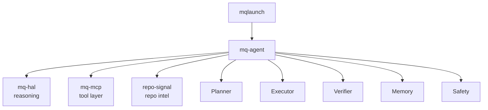

# mq-agent

[](https://github.com/MCamner/mq-agent/actions)
[](https://www.python.org/)
[](https://mcamner.github.io/mq-agent/)
[](https://mcamner.github.io/mq-agent/)

Terminal-native AI agent orchestrator for the mq ecosystem.

## 30 second demo

```bash
mq-agent doctor                    # check environment
mq-agent score .                   # README + publish score (no API key)
mq-agent audit . --dry-run         # repo audit plan
mq-agent release-check --dry-run   # release readiness plan
```



Screenshots/gallery: the GitHub Pages demo page shows the current command
surface and release proof.

## Why

Most AI coding tools either wrap a model around shell commands or hide execution behind a chat UI.

mq-agent is different: it treats agent work as a controlled terminal workflow with explicit planning, tool routing, verification, memory and safety gates. Every action is traceable, every operation is gated, and the model never runs unsupervised.

## Use cases

mq-agent is useful when you want to:

- audit a repository before publishing
- generate a release readiness plan with explicit approval gates
- score README and publish quality without an API key
- inspect and fix CI failures with AI-generated steps
- run safe terminal workflows where the model cannot act without permission
- combine repo-signal, mq-mcp and mq-hal into one local agent workflow

## What it is

Not an AI wrapper script. An actual orchestrator with:

| Layer        | Responsibility               |
|--------------|------------------------------|
| **Planner**  | Decomposes goals into steps  |
| **Executor** | Runs steps through tools     |
| **Verifier** | Checks each result with AI   |
| **Memory**   | Session + persistent state   |
| **Safety**   | Enforces operation modes     |

## Quick start

```bash
# Install
uv pip install -e ".[dev,signal]"

# Check environment
mq-agent doctor

# Score a repo (no API key needed)
mq-agent score .

# Full AI-backed repo assessment
export OPENAI_API_KEY=sk-...
mq-agent signal .

# Read-only audit
mq-agent audit .
```

## Install

### Local development

```bash
uv pip install -e ".[dev,signal]"
```

### From GitHub

```bash
pipx install git+https://github.com/MCamner/mq-agent.git
```

### PyPI (planned)

```bash
pipx install mq-agent   # coming soon
```

Requires `OPENAI_API_KEY` for AI commands. `score`, `doctor`, `repo-summary` and `tools` work without it.

## Demo

```text
$ mq-agent score .
╭──────────────────────── README Score ─────────────────────────╮
│ README score: 100/100  [██████████]                           │
│ ✓ title  ✓ install  ✓ usage  ✓ examples  ✓ badges            │
│ ✓ license  ✓ roadmap  ✓ contributing  (none missing)          │
╰───────────────────────────────────────────────────────────────╯
╭──────────────────── Publish Checklist ────────────────────────╮
│ Publish checklist: 16/16  [PASS]                              │
│ Repo looks publish-ready from the static checklist.           │
╰───────────────────────────────────────────────────────────────╯
```

See [docs/DEMO.md](docs/DEMO.md) for the full end-to-end walkthrough.

## CLI

```bash
mq-agent audit .                   # Read-only repo audit
mq-agent release-plan              # Show release plan
mq-agent release-check             # Validate release readiness (suggest mode)
mq-agent release-check --approve   # Execute checks
mq-agent repo-summary .            # Quick repo overview
mq-agent run "pytest" --approve    # Safe shell execution
mq-agent fix-ci                    # Diagnose CI failures
mq-agent doctor                    # Check environment
mq-agent tools                     # List registered tools
mq-agent tools --mcp               # Include discovered MCP tools
mq-agent tools --describe <name>   # Show tool metadata and safety class
mq-agent mcp status                # Check mq-mcp reachability and tool counts
mq-agent mcp tools                 # List all MCP tools with safety classes
mq-agent run-tool <tool>           # Run an MCP tool through safety gates
mq-agent tui                       # Launch Textual dashboard

# All commands support --dry-run and --json
mq-agent audit . --dry-run
mq-agent run-tool read_repo_file --arg path=README.md --dry-run
```

## Safety modes

```text
read-only   → only read tools allowed
suggest     → plan shown, nothing executed (default for most commands)
execute     → runs after safety check (requires --approve for destructive ops)
dangerous   → no restrictions (requires explicit flag)
```

## Architecture

```text
mq_agent/
├── core/
│   ├── state.py          # AgentState, PlanStep, SafetyMode, StepStatus
│   ├── planner.py        # OpenAI-backed plan generation
│   ├── executor.py       # Tool routing + safety enforcement
│   ├── verification.py   # OpenAI-backed result verification
│   ├── memory.py         # Session + persistent memory
│   └── safety.py         # Safety gate (mode enforcement)
├── tools/
│   ├── git_tools.py      # git_status, git_log, git_diff, git_branch, git_remote
│   ├── shell_tools.py    # run_command (blocked pattern list)
│   ├── repo_tools.py     # repo_summary, list_files, read_file, find_files
│   ├── signal_tools.py   # repo_scan, repo_readme_score, repo_publish_checklist, repo_analyze
│   └── mcp_bridge.py     # HTTP bridge to mq-mcp
├── agents/
│   ├── audit_agent.py    # Repo audit (read-only)
│   ├── release_agent.py  # Release validation
│   ├── ci_agent.py       # CI failure diagnosis
│   ├── docs_agent.py     # Documentation audit
│   └── signal_agent.py   # repo-signal static scan + AI improvement plan
├── tui/
│   └── app.py            # Textual dashboard
├── prompts/
│   ├── planner.md        # System prompt for Planner
│   └── verifier.md       # System prompt for Verifier
└── tasks/
    ├── release.yaml      # Declarative release task
    ├── audit.yaml        # Declarative audit task
    └── fix_ci.yaml       # Declarative CI fix task
```

## Proof

- 70 tests pass — `uv run pytest -v` — no OpenAI calls required
- `mq-agent score .` — 100/100 README, 16/16 publish checklist [PASS]
- `mq-agent doctor` — all required checks pass
- `mq-agent audit . --dry-run` — safe, read-only plan generation
- `mq-agent signal . --dry-run` — repo-signal assessment without execution
- Safety modes documented and enforced — dangerous patterns blocked at tool level
- `--dry-run` and `--json` supported on all commands

```bash
uv run pytest tests/ -v
```

## Docs

- [Command reference](docs/COMMANDS.md)
- [Command surface](docs/COMMAND_SURFACE.md)
- [Safety contract](docs/SAFETY_CONTRACT.md)
- [mq ecosystem](docs/MQ_ECOSYSTEM.md)
- [Skills](SKILLS.md)
- [Examples](docs/EXAMPLES.md)
- [Safety](docs/SAFETY.md)
- [Roadmap](docs/ROADMAP.md)
- [Release checklist](docs/RELEASE_CHECKLIST.md)
- [Contributing](CONTRIBUTING.md)
- [Changelog](CHANGELOG.md)

## v0.5.0 status

- [x] Planner (OpenAI gpt-4o, structured JSON output)
- [x] Executor (tool registry, dry-run, safety gate)
- [x] Verifier (OpenAI gpt-4o-mini, per-step verification)
- [x] Memory (session + persistent JSON)
- [x] Safety (read-only / suggest / execute / dangerous)
- [x] Git tools, shell tools, repo tools
- [x] MCP bridge (mq-mcp over HTTP) with safety classification
- [x] Audit agent, Release agent, CI agent, Docs agent, Signal agent
- [x] Textual TUI, JSON output, `--dry-run` on all commands
- [x] `mq-agent doctor` — full environment check
- [x] `mq-agent mcp status` / `mq-agent mcp tools` — MCP inspection
- [x] `mq-agent tools --describe <name>` — tool metadata and safety class
- [x] `mq-agent run-tool <tool>` — MCP tool through safety gates
- [x] MCP safety classes: read-only / write-capable / subprocess / dangerous / unknown
- [x] mqlaunch bridge — 12-item agent menu + 6 direct prompt commands
- [x] `scripts/smoke-mqlaunch.sh` — verifies `mqlaunch agent ...` reaches mq-agent
- [x] `docs/MQLAUNCH_INTEGRATION.md` — bridge architecture and usage
- [x] `docs/COMMAND_SURFACE.md` — single source of truth for command counts
- [x] 70 tests pass — `uv run pytest -v` — no OpenAI calls required
- [x] Semantic repository memory — `mq-agent memory status / build / refresh`

## Semantic repository memory

mq-agent v0.5.0 can inspect and build semantic repository memory via repo-signal.

```bash
mq-agent memory status          # check vector store and repo-signal
mq-agent memory build .         # preview upload (dry-run default)
mq-agent memory refresh . --approve  # upload when ready
```

Memory upload is explicit and gated. mq-agent never uploads silently.

See [docs/SEMANTIC_MEMORY.md](docs/SEMANTIC_MEMORY.md).

## mqlaunch integration

`mq-agent` is fully wired into `mqlaunch` as both a direct command surface and
an interactive menu.

```bash
mqlaunch agent
mqlaunch agent score .
mqlaunch agent audit .
mqlaunch agent doctor
mqlaunch agent release-check --dry-run
mqlaunch agent mcp-status
mqlaunch agent mcp-tools
```

See [docs/COMMAND_SURFACE.md](docs/COMMAND_SURFACE.md) for the canonical
command surface and [docs/MQLAUNCH_INTEGRATION.md](docs/MQLAUNCH_INTEGRATION.md)
for bridge details.

## Roadmap

- Autonomous looping agents
- Browser control
- Multi-agent swarms

See [docs/ROADMAP.md](docs/ROADMAP.md) for details.

## Notes

Do not commit API keys, local secrets, or private environment files.
