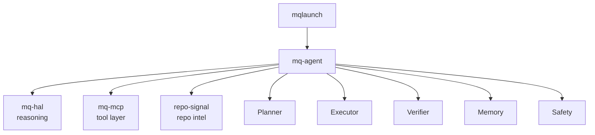

# mq-agent


Terminal-native AI agent orchestrator for the mq ecosystem.



## Why

Most AI coding tools either wrap a model around shell commands or hide execution behind a chat UI.

mq-agent is different: it treats agent work as a controlled terminal workflow with explicit planning, tool routing, verification, memory and safety gates. Every action is traceable, every operation is gated, and the model never runs unsupervised.

## What it is

Not an AI wrapper script. An actual orchestrator with:

| Layer        | Responsibility               |
|--------------|------------------------------|
| **Planner**  | Decomposes goals into steps  |
| **Executor** | Runs steps through tools     |
| **Verifier** | Checks each result with AI   |
| **Memory**   | Session + persistent state   |
| **Safety**   | Enforces operation modes     |

## Install

```bash
./scripts/install.sh
# or
uv pip install -e ".[dev,signal]"
```

Requires `OPENAI_API_KEY` in environment.

## CLI

```bash
mq-agent audit .                   # Read-only repo audit
mq-agent release-plan              # Show release plan
mq-agent release-check             # Validate release readiness (suggest mode)
mq-agent release-check --approve   # Execute checks
mq-agent repo-summary .            # Quick repo overview
mq-agent run "pytest" --approve    # Safe shell execution
mq-agent fix-ci                    # Diagnose CI failures
mq-agent doctor                    # Check environment
mq-agent tools                     # List registered tools
mq-agent tui                       # Launch Textual dashboard

# All commands support --dry-run and --json
mq-agent audit . --dry-run
mq-agent audit . --json
```

## Safety modes

```text
read-only   → only read tools allowed
suggest     → plan shown, nothing executed (default for most commands)
execute     → runs after safety check (requires --approve for destructive ops)
dangerous   → no restrictions (requires explicit flag)
```

## Architecture

```text
mq_agent/
├── core/
│   ├── state.py          # AgentState, PlanStep, SafetyMode, StepStatus
│   ├── planner.py        # OpenAI-backed plan generation
│   ├── executor.py       # Tool routing + safety enforcement
│   ├── verification.py   # OpenAI-backed result verification
│   ├── memory.py         # Session + persistent memory
│   └── safety.py         # Safety gate (mode enforcement)
├── tools/
│   ├── git_tools.py      # git_status, git_log, git_diff, git_branch, git_remote
│   ├── shell_tools.py    # run_command (blocked pattern list)
│   ├── repo_tools.py     # repo_summary, list_files, read_file, find_files
│   ├── signal_tools.py   # repo_scan, repo_readme_score, repo_publish_checklist, repo_analyze
│   └── mcp_bridge.py     # HTTP bridge to mq-mcp
├── agents/
│   ├── audit_agent.py    # Repo audit (read-only)
│   ├── release_agent.py  # Release validation
│   ├── ci_agent.py       # CI failure diagnosis
│   ├── docs_agent.py     # Documentation audit
│   └── signal_agent.py   # repo-signal static scan + AI improvement plan
├── tui/
│   └── app.py            # Textual dashboard
├── prompts/
│   ├── planner.md        # System prompt for Planner
│   └── verifier.md       # System prompt for Verifier
└── tasks/
    ├── release.yaml      # Declarative release task
    ├── audit.yaml        # Declarative audit task
    └── fix_ci.yaml       # Declarative CI fix task
```

## Tests

```bash
pytest tests/ -v
```

37 tests, no OpenAI calls required.

## Docs

- [Examples](docs/EXAMPLES.md)
- [Safety](docs/SAFETY.md)
- [Roadmap](docs/ROADMAP.md)
- [Integrations](docs/INTEGRATIONS.md)
- [Release checklist](docs/RELEASE_CHECKLIST.md)
- [Contributing](CONTRIBUTING.md)
- [Changelog](CHANGELOG.md)

## v0.2.0 status

- [x] Planner (OpenAI gpt-4o, structured JSON output)
- [x] Executor (tool registry, dry-run, safety gate)
- [x] Verifier (OpenAI gpt-4o-mini, per-step verification)
- [x] Memory (session + persistent JSON)
- [x] Safety (read-only / suggest / execute / dangerous)
- [x] Git tools
- [x] Shell tools (blocked pattern list)
- [x] Repo tools
- [x] MCP bridge (mq-mcp over HTTP)
- [x] Audit agent
- [x] Release agent
- [x] CI agent
- [x] Textual TUI
- [x] JSON output on all commands
- [x] Dry-run on all commands
- [x] `mq-agent doctor`
- [x] repo-signal integration
- [x] `mq-agent signal` — full scored repo assessment with AI improvement plan
- [x] `mq-agent score` — instant README + publish checklist (no API key needed)

## Not in v0.2.0

- Autonomous looping agents
- Browser control
- Multi-agent swarms

## Notes

Do not commit API keys, local secrets, or private environment files.
