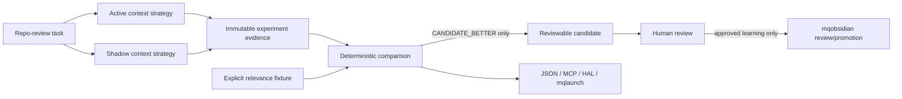

# Feedback Engine v1.33

The Feedback Engine is mq-agent's evidence-first loop for comparing one active
context strategy with one zero-effect shadow strategy.

It measures and records evidence. v1.32 can activate one task-class policy only
after explicit human approval and a bounded Canary v2 PLAN/RESULT lifecycle; it
never auto-activates a policy.

## Architecture



The shadow path cannot modify the production prompt, routing, repository,
tools, durable memory, approvals, or the real task result.

## Commands

Read-only inspection:

```bash
mq-agent feedback status
mq-agent feedback recent --limit 10
mq-agent feedback inspect <feedback-run-id>
mq-agent feedback report --task-class repo-review --since 30d
mq-agent feedback candidates
mq-agent feedback candidate <candidate-id>
mq-agent feedback activation-readiness <candidate-id>
```

Stable machine output:

```bash
mq-agent feedback status --json
mq-agent feedback report --task-class repo-review --since 30d --json
mq-agent feedback compare <feedback-run-id> --json
```

Explicit evidence-producing shadow run:

```bash
mq-agent feedback run \
  --task-class repo-review \
  --repo . \
  --task "review release boundaries" \
  --execution-run-id <mq.execution-outcome-run-id> \
  --json
```

A real F2 run without an explicit relevance fixture normally ends with
`INSUFFICIENT_EVIDENCE`. That is intentional: context size and latency are
operational measurements, not proof that one retrieval strategy is better.

## Evaluation

A deterministic relevance fixture may be supplied when there is an explicit
expected evidence set:

```bash
mq-agent feedback compare <feedback-run-id> \
  --fixture path/to/relevance-fixture.json \
  --json
```

The comparison keeps each metric visible. Quality improvement cannot hide a
material latency regression, and model-only preference cannot create a verdict.

## Candidates

Only a deterministic `CANDIDATE_BETTER` comparison may create a review
proposal. A candidate contains its comparison references, gains, regressions,
limitations and rollback target.

Candidates cannot activate production policy by themselves. v1.31 requires a
separate expiring approval receipt and a new post-approval canary before an
operator may explicitly activate one task class. Memory candidates still use
the existing mqobsidian review/promotion boundary rather than writing durable
memory directly.

### Activation and rollback

`mq-agent feedback activation-readiness <candidate-id>` remains the read-only
evidence gate. v1.31 adds a separate human-controlled sequence:

```bash
mq-agent feedback approve <candidate-id> --reason "reviewed evidence" --approve
mq-agent feedback canary-plan <candidate-id> \
  --approval-id <approval-id> \
  --executions 3 \
  --min-executions 3 \
  --max-duration-seconds 300 \
  --max-failure-rate 0
mq-agent feedback canary-run <canary-id> \
  --task "review release boundaries" \
  --fixture path/to/relevance-fixture.json
mq-agent feedback canary-status <canary-id>
mq-agent feedback activate <candidate-id> \
  --approval-id <approval-id> \
  --canary-id <canary-id> \
  --reason "bounded Canary v2 passed" \
  --approve
mq-agent feedback post-activation-check repo-review --comparison-id <comparison-id>
mq-agent feedback rollback <activation-event-id> \
  --reason "regression observed" \
  --approve
```

Approval is content-bound and expires when the candidate readiness/fingerprint
or active policy changes. Canary v2 binds an immutable plan to that approval
and policy snapshot, executes at most the declared budget, and appends at most
one result. Activation accepts only a deterministic PASS for the exact
candidate/approval and re-verifies the referenced experiments/comparisons.
Activation and rollback append policy events; they never rewrite evidence
history. v1.33 also binds each new policy event to immutable policy snapshots.

`READY_FOR_HUMAN_APPROVAL` keeps the original blockers — effective
`proposed` context-strategy state, complete comparison links, exact task class
and strategy pair, valid `CANDIDATE_BETTER` verdicts, no material regression,
and exact rollback target — but the evidence floor is no longer a global
two-comparison/two-snapshot rule.

Promotion-authorizing evidence now resolves:

```text
comparison
  -> feedback experiment
  -> exact execution_run_id
  -> mq.execution-outcome.v1
```

For the feedback task class, readiness requires a real correlated calibration
population, then derives bounded requirements for candidate-linked outcome
sample size, temporal coverage and success rate from that population. The
feedback task-class name remains authoritative: mq-agent does not pretend that
`repo-review` equals `audit`, `docs`, or another execution-outcome class.

The calibration population and exact candidate-linked outcomes are fingerprinted.
A new approval receipt binds that readiness fingerprint, so later evidence drift
requires a fresh human approval. Historical v1 approval records remain readable
but cannot authorize a new canary without being reissued.

A shadow experiment without `--execution-run-id` is still valid for analysis,
but it cannot satisfy the real-outcome promotion evidence gates.

The readiness result still says `human_approval_required: true`,
`canary_required: true`, and `activation_available: false`. Readiness itself
does not mutate policy. The separate v1.31 approval/canary/activation commands
own the controlled write path.

Exit status is machine-usable: 0 is ready for human approval, 1 means more
evidence is required, and 2 means a blocker must be resolved.

## Runtime storage

Feedback runtime evidence lives outside Git under the configured feedback state
root. Clients consume mq-agent commands/contracts and must not edit that store
directly.

Persisted records exclude raw prompts, task bodies, diffs, source bodies,
stdout/stderr and credentials.

## Client access

- Codex and Claude use the same mq-mcp feedback tools.
- mq-hal renders mq-agent's verdict and evidence without recomputing it.
- mqlaunch delegates `feedback ...` to mq-agent and preserves exit status.
- scripts and CI use `mq-agent feedback ... --json`.

See [Feedback Engine client contract](feedback-engine-clients.md).

## v1.33 Policy Registry v2 boundary

Each new activation records immutable before/after
`mq.feedback-policy-snapshot.v1` records. Snapshot fingerprints are verified
before rollback, and rollback addresses one exact activation policy event id.

A rollback is allowed only when that activation is still the latest policy
event for its task class and its after-snapshot still matches the active
strategy. Legacy activation events without snapshot bindings remain readable
but cannot be used as v1.33 rollback targets.

```bash
mq-agent feedback policy repo-review --json
mq-agent feedback rollback <activation-event-id> \
  --reason "material regression observed" \
  --approve \
  --json
```

## v1.32 Canary v2 boundary

v1.32 replaces one-shot canary authorization with `mq.feedback-canary.v1`.
A PASS requires the declared minimum count of `CANDIDATE_BETTER` comparisons,
a failure rate at or below the plan threshold, no material regressions, and no
approval/policy drift. `FAIL` and `INSUFFICIENT_EVIDENCE` cannot activate.

`fallback_delta` remains null until feedback experiments carry a correlated,
measured fallback delta; unavailable evidence is never converted to zero.

Legacy `feedback canary-check` remains read-only for v1.31 evidence and is
not an activation-authorizing surface.

## v1.31 boundary

v1.31 permits controlled activation only when all of these are true:

- one task class is selected;
- readiness is `READY_FOR_HUMAN_APPROVAL`;
- an explicit, unexpired approval receipt exists;
- new post-approval canary evidence is valid and `CANDIDATE_BETTER`;
- the operator explicitly passes `--approve`.

The existing `context pack --codegraph auto` path is unchanged. Activated
feedback policy is consumed only through explicit `--codegraph policy`.
`MQ_FEEDBACK_ACTIVATION=off` disables feedback policy consumption without
deleting activation/evidence history.

## v1.30 boundary

v1.30 does not ship:

- automatic activation;
- autonomous routing changes;
- direct durable-memory writes from feedback;
- a client-specific Feedback Engine;
- a global opaque score;
- raw conversation capture.

Controlled activation is a post-v1.30 design gate and requires separate,
task-class-specific evidence and human approval.
