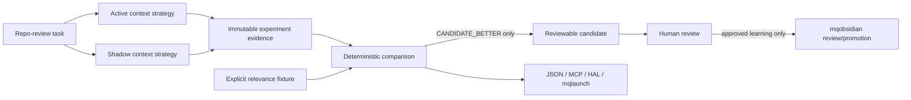

# Feedback Engine v1.30

The Feedback Engine is mq-agent's evidence-first loop for comparing one active
context strategy with one zero-effect shadow strategy.

It measures and records evidence. It does **not** activate a policy.

## Architecture



The shadow path cannot modify the production prompt, routing, repository,
tools, durable memory, approvals, or the real task result.

## Commands

Read-only inspection:

```bash
mq-agent feedback status
mq-agent feedback recent --limit 10
mq-agent feedback inspect <feedback-run-id>
mq-agent feedback report --task-class repo-review --since 30d
mq-agent feedback candidates
mq-agent feedback candidate <candidate-id>
```

Stable machine output:

```bash
mq-agent feedback status --json
mq-agent feedback report --task-class repo-review --since 30d --json
mq-agent feedback compare <feedback-run-id> --json
```

Explicit evidence-producing shadow run:

```bash
mq-agent feedback run \
  --task-class repo-review \
  --repo . \
  --task "review release boundaries" \
  --json
```

A real F2 run without an explicit relevance fixture normally ends with
`INSUFFICIENT_EVIDENCE`. That is intentional: context size and latency are
operational measurements, not proof that one retrieval strategy is better.

## Evaluation

A deterministic relevance fixture may be supplied when there is an explicit
expected evidence set:

```bash
mq-agent feedback compare <feedback-run-id> \
  --fixture path/to/relevance-fixture.json \
  --json
```

The comparison keeps each metric visible. Quality improvement cannot hide a
material latency regression, and model-only preference cannot create a verdict.

## Candidates

Only a deterministic `CANDIDATE_BETTER` comparison may create a review
proposal. A candidate contains its comparison references, gains, regressions,
limitations and rollback target.

Candidates cannot activate production policy. Memory candidates use the
existing mqobsidian review/promotion boundary rather than writing durable
memory directly.

## Runtime storage

Feedback runtime evidence lives outside Git under the configured feedback state
root. Clients consume mq-agent commands/contracts and must not edit that store
directly.

Persisted records exclude raw prompts, task bodies, diffs, source bodies,
stdout/stderr and credentials.

## Client access

- Codex and Claude use the same mq-mcp feedback tools.
- mq-hal renders mq-agent's verdict and evidence without recomputing it.
- mqlaunch delegates `feedback ...` to mq-agent and preserves exit status.
- scripts and CI use `mq-agent feedback ... --json`.

See [Feedback Engine client contract](feedback-engine-clients.md).

## v1.30 boundary

v1.30 does not ship:

- automatic activation;
- autonomous routing changes;
- direct durable-memory writes from feedback;
- a client-specific Feedback Engine;
- a global opaque score;
- raw conversation capture.

Controlled activation is a post-v1.30 design gate and requires separate,
task-class-specific evidence and human approval.
