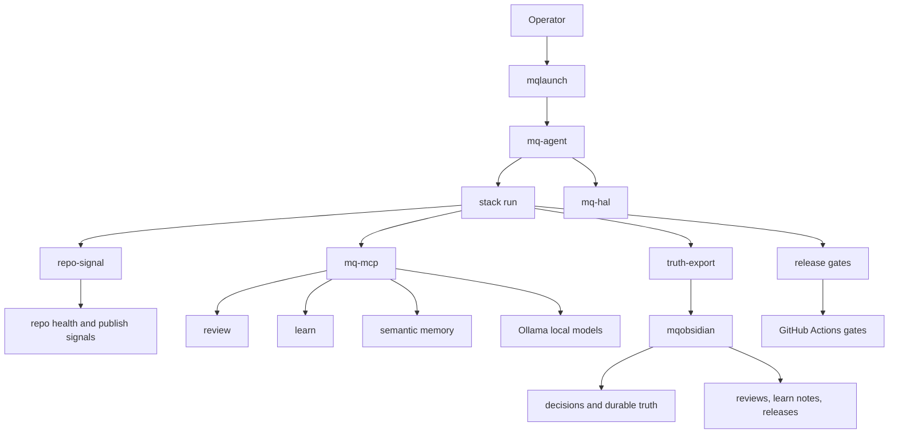

# MQ Control Plane

`mq-agent` is the control plane for the local MQ ecosystem. It should
orchestrate the loop without absorbing the responsibilities of the other repos.

## Boundary

```text
mqlaunch → starts
mq-agent → orchestrates
repo-signal → measures
mq-mcp → reviews, learns, and retrieves memory
mqobsidian → remembers
ollama → reasons locally
mq-hal → presents operator state
```

The key rule is simple: `mq-agent` coordinates and gates work; it does not
reimplement repo analysis, review logic, memory retrieval, model inference, or
operator presentation.

## System Map



## Canonical Runtime

The current runtime entrypoints are:

```bash
mq-agent stack run
mq-agent run --stack
```

The stack runtime checks:

```text
repo-signal
mq-mcp
ollama
brain export
release
```

It is read-only by default. `--brain` writes the stack truth export only when
paired with `--approve`.

```bash
mq-agent stack run --dry-run
mq-agent stack run --json
mq-agent stack run --markdown
mq-agent stack run --brain --approve
mq-agent stack run --ci
```

## Canonical Pipeline

The v1.16 consolidation defines one operator flow. `stack run` includes this
pipeline in both JSON and Markdown output:

```text
discover
→ repo-signal
→ review
→ learn
→ truth-export
→ release
→ dashboard
```

Existing commands can remain as focused escape hatches, but the default
operator path should be the runtime pipeline.

## Memory Direction

The next leverage point is making `mqobsidian` more than an export target.

Planned memory surfaces:

```bash
mq-agent memory ingest
mq-agent memory query
mq-agent memory summarize
mq-agent memory timeline
```

Target vault shape:

```text
mqobsidian/
├── truth/
├── reviews/
├── learn/
├── releases/
├── architecture/
└── decisions/
```

This should allow old decisions, reviews, learned patterns, and release truth
to feed later reviews and stack runs.

## Model Direction

Ollama is becoming a first-class runtime dependency rather than an incidental
learn backend.

Model profiles:

```text
fast
review
planner
memory
```

Example mapping:

```text
fast → qwen
review → gpt
memory → mq-learn
```

Runtime surface:

```bash
mq-agent models list
mq-agent models current
mq-agent models switch qwen3 --profile review --approve
mq-agent models bench
```

## Dashboard Direction

`mq-agent dashboard` should come before HAL owns a polished presentation layer.
The first dashboard should be a TUI over existing facts:

```text
Stack Health
Brain
Release
Contracts
Memory
Models
```

## Release Discipline

`mq-agent doctor` is already the environment check. The release-facing version
of this should verify:

```text
VERSION
CHANGELOG
README
ROADMAP
repo-contract
CI
tag state
```

## Current Priority

The next high-value sequence is:

```text
mq-agent
→ memory
→ mqobsidian
→ ollama
```

That keeps the control plane useful without making it too broad.
